# SuperMall Web Application

SuperMall is a web-based platform where **admins can manage shops and offers** while **users can browse, compare, and filter shops/offers**.  
The system uses **Firebase** for authentication, database, and storage. Deployment is done on **Netlify**.

Live link: https://supermall-webapp.netlify.app/

---

## Features

### Authentication
- User & Admin **registration/login**
- **Role-based access** (user vs. admin)
- Secure **Firebase Authentication**
- **Forgot password** with reset email

### User Features
- Browse shops & offers
- Filter shops by categories
- Compare offers side-by-side
- Responsive dashboard UI

### Admin Features
- Create / manage shops
- Create / manage offers
- Edit / delete functionality
- Action logging for security

### General
- Firebase Firestore for storing shop, offer & user data
- Logs stored for admin/user actions
- Fully responsive design with **modern CSS**

---

## Tech Stack

- **Frontend**: HTML, CSS, JavaScript  
- **Backend**: Firebase Authentication, Firestore, Storage  
- **Hosting**: Netlify  

---

## Setup Instructions

### Clone the Repository
```bash
git clone https://github.com/22BCE8093-Eswar/Super-Mall
cd Super-Mall
````

### Configure Firebase

Create a project in Firebase Console
.

Enable Authentication (Email/Password).

Enable Firestore Database (in test or production mode).

Enable Storage (optional, for shop/offer images).

Add your web app in Firebase, then copy the config into firebase-config.js:
````
const firebaseConfig = {
  apiKey: "YOUR_API_KEY",
  authDomain: "YOUR_PROJECT.firebaseapp.com",
  projectId: "YOUR_PROJECT",
  storageBucket: "YOUR_PROJECT.appspot.com",
  messagingSenderId: "SENDER_ID",
  appId: "APP_ID",
  measurementId: "MEASUREMENT_ID"
};

export { firebaseConfig };

````
Add your Netlify domain (e.g., supermall.netlify.app) to Firebase → Authentication → Settings → Authorized Domains.

### Run Locally

Since it’s a static site, just open index.html in a browser, or use a local server:

npx live-server

### Deployment on Netlify
Option 1: Deploy via GitHub

Push your project to GitHub:

git init
git add .
git commit -m "Initial commit"
git branch -M main
git remote add origin https://github.com/your-username/supermall.git
git push -u origin main


### Go to Netlify
.

Click New Site from Git → Choose GitHub → Select repo.

Configure:

Build Command: leave blank

Publish Directory: / (root)

Click Deploy.

Option 2: Drag & Drop

Build your project (not needed here since no bundler).

Drag the whole folder into Netlify Deploy page.

### Netlify Redirects (for Firebase Auth)

Create a _redirects file in the project root with:
````
/* /index.html 200
````

### Example Credentials

Admin role → must register first, role will be set to admin_request (and later promoted).

User role → registers directly as user.

### Future Enhancements

Add categories & images for shops/offers

Payment gateway integration

Real-time notifications

Admin approval dashboard for admin_request

### Preview

<table>
  <tr>
    <th> Index Page</th>
    <th> Index 2 Page</th>
    <th> Admin Register Page</th>
  </tr>
  <tr>
    <td>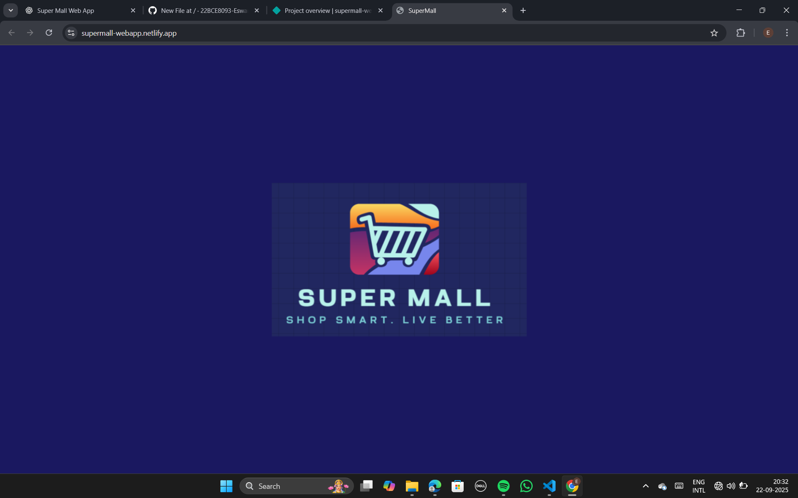 </td>
    <td>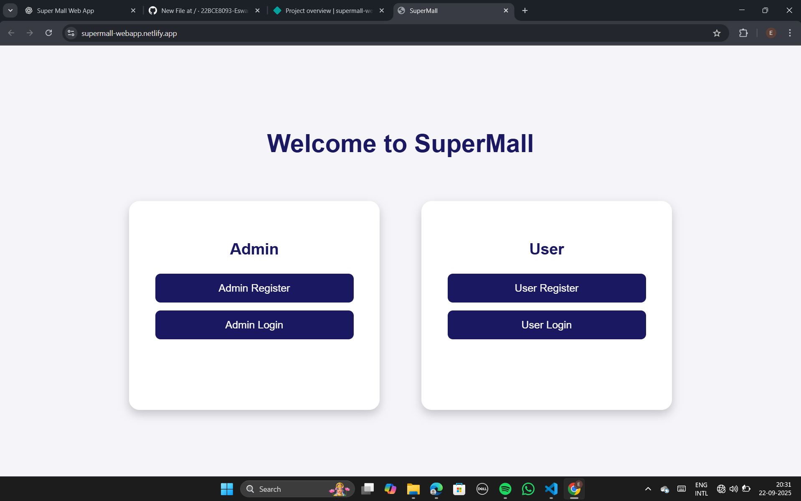 </td>
    <td>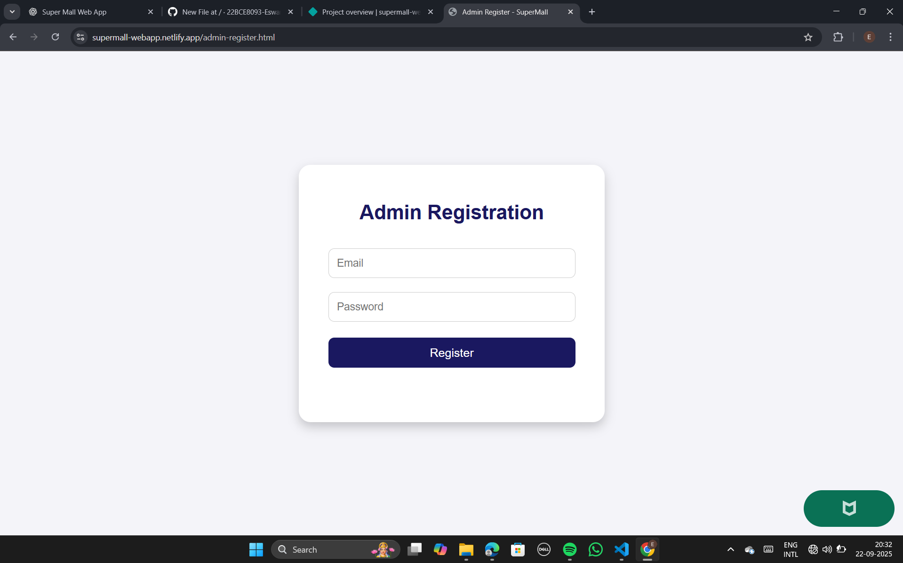 </td>
  </tr>
</table>

<table>
  <tr>
    <th> Admin Login Page</th>
    <th> User Register Page</th>
    <th> User Login Page</th>
  </tr>
  <tr>
    <td> </td>
    <td>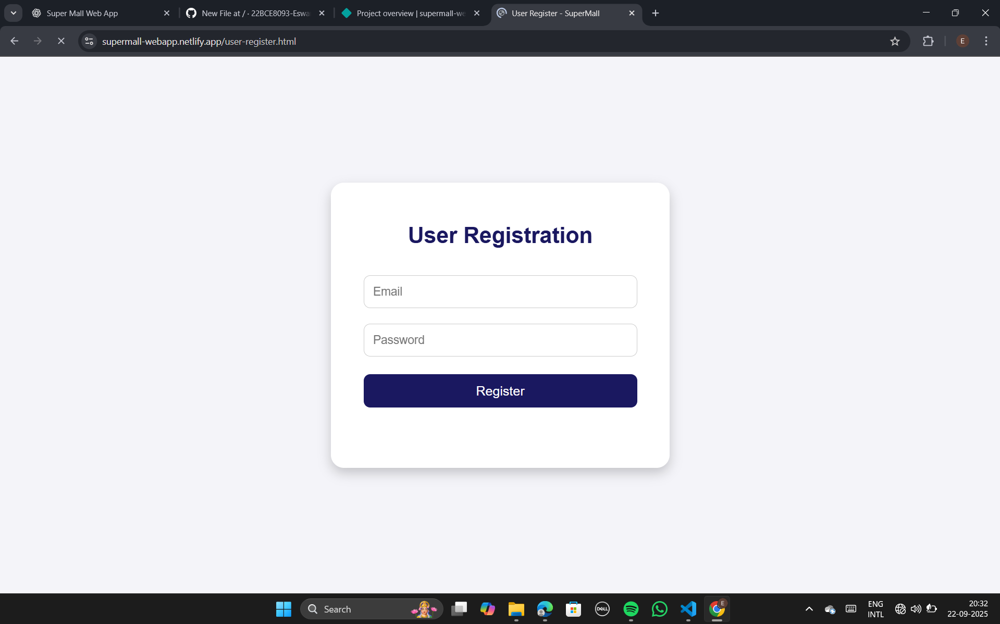 </td>
    <td>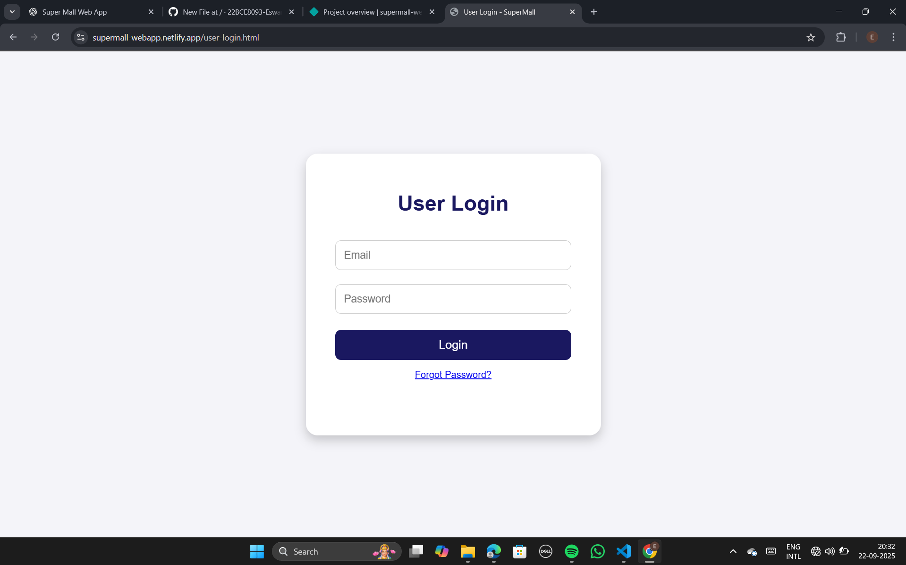 </td>
  </tr>
</table>

<table>
  <tr>
    <th> Create Shop Page</th>
    <th> Manage Shop Page</th>
    <th> Manage Offers Page</th>
  </tr>
  <tr>
    <td>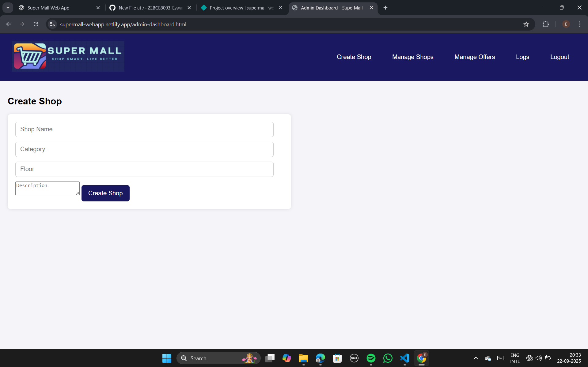 </td>
    <td>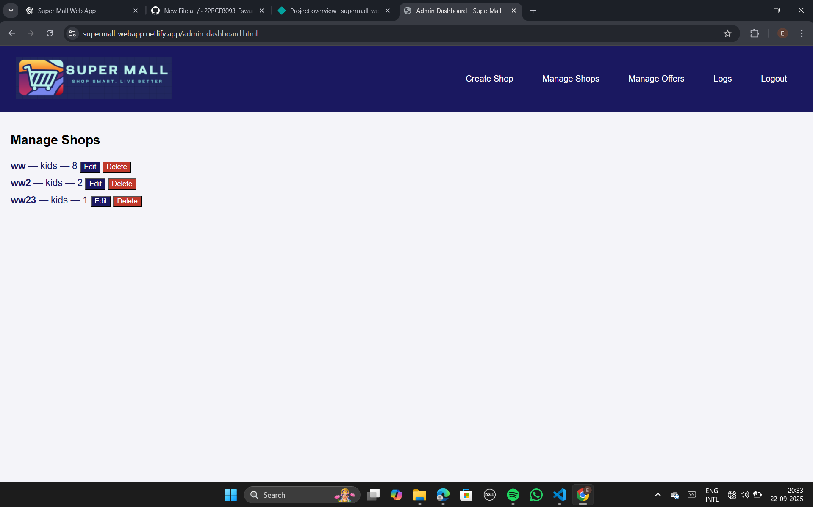 </td>
    <td>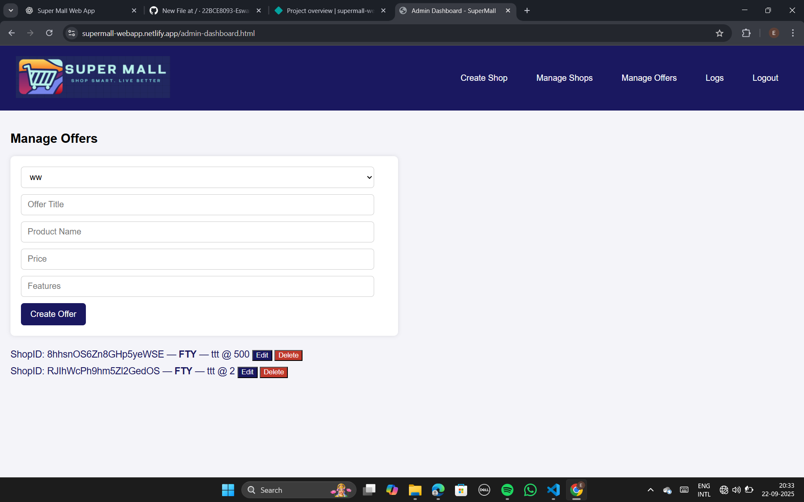 </td>
  </tr>
</table>

<table>
  <tr>
    <th> Logs Page</th>
    <th> Filter Shops Page</th>
    <th> Shops Page</th>
  </tr>
  <tr>
    <td>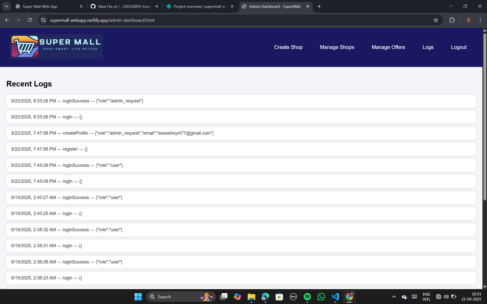 </td>
    <td>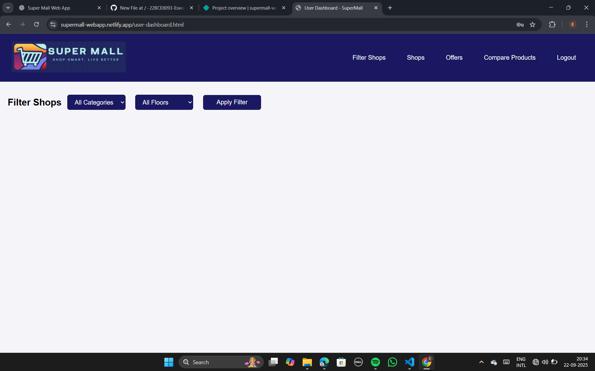 </td>
    <td>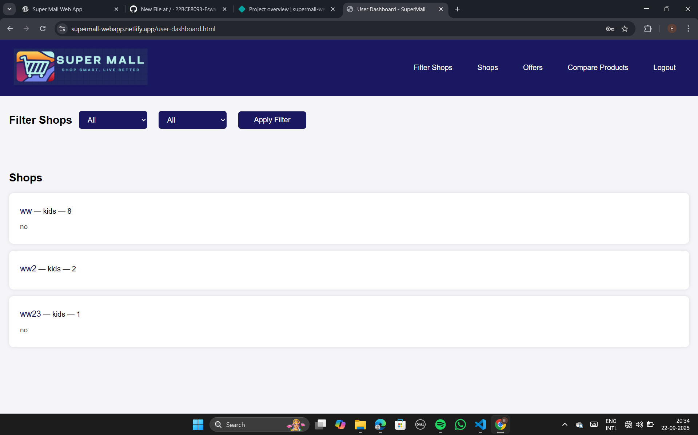 </td>
  </tr>
</table>

<table>
  <tr>
    <th> Offers Page</th>
    <th> Compare Products Page</th>
  </tr>
  <tr>
    <td>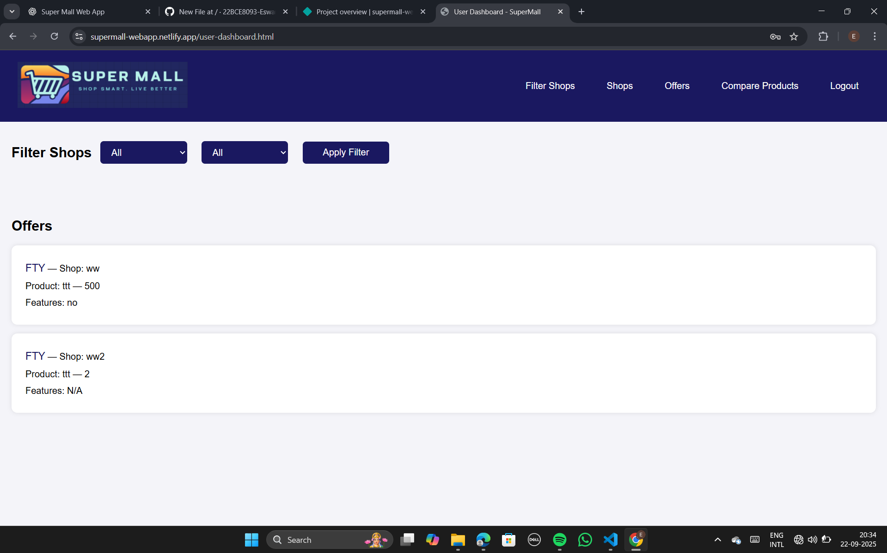 </td>
    <td>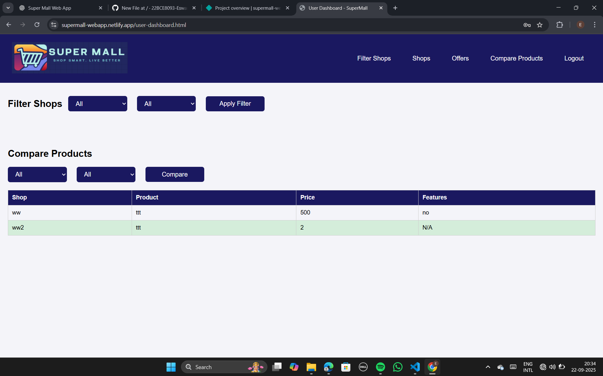 </td>
  </tr>
</table>
